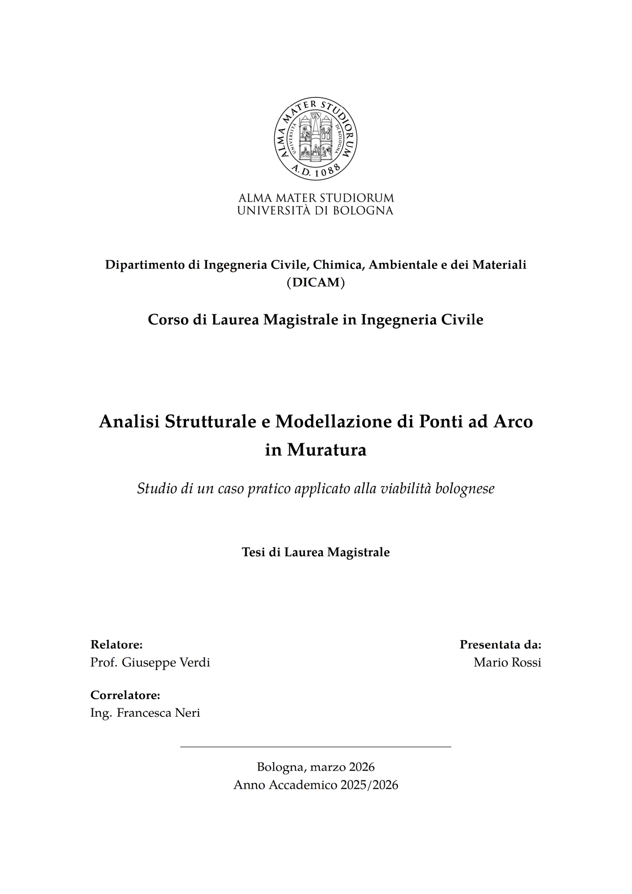
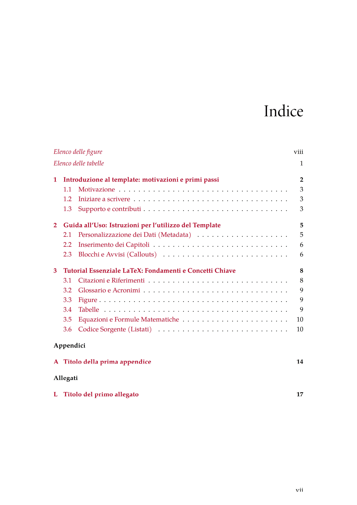
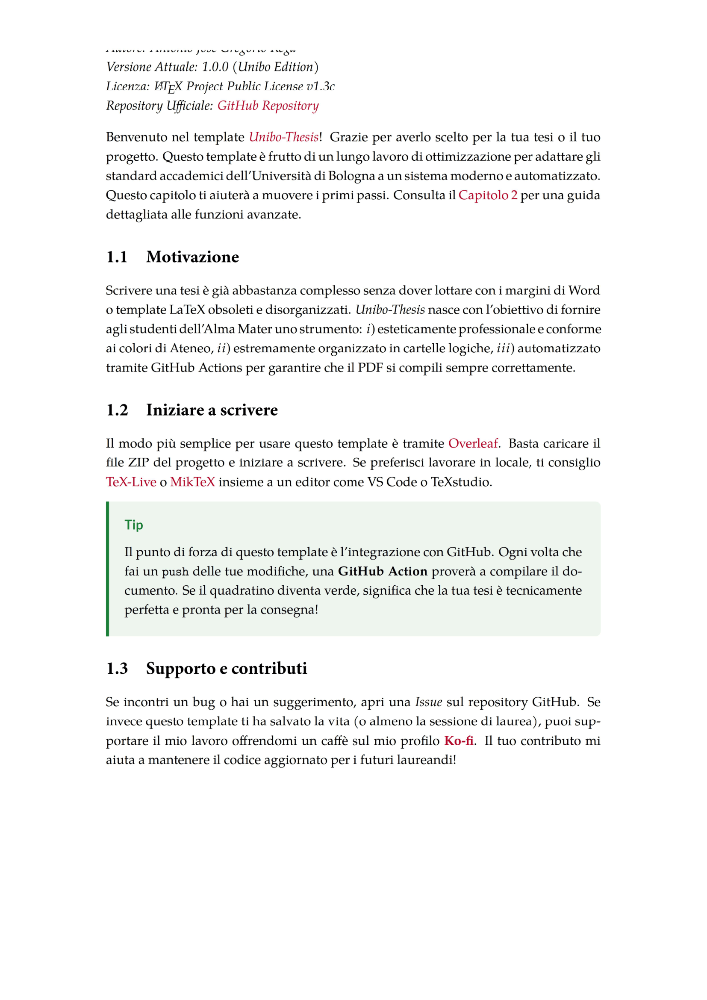

---

    <h1 align="center">Unibo Thesis</h1>
    
<i>Template LaTeX per tesi di laurea — Alma Mater Studiorum, Università di Bologna</i>

    <a href="https://github.com/antoniojoserega/unibo-thesis/issues/new?labels=bug" target="_blank">Segnala un bug</a>
·
    <a href="https://github.com/antoniojoserega/unibo-thesis/issues/new?labels=enhancement" target="_blank">Richiedi una feature</a>
·
    <a href="mailto:antonio.jose.rega@gmail.com" target="_blank">Fai una domanda</a>

    
    
    
    

 

<b>Unibo Thesis</b> è un template LaTeX open-source <b>progettato per la stesura professionale di tesi di laurea (Triennale, Magistrale) e di dottorato</b>, pensato specificamente per gli studenti dell'<a href="https://www.unibo.it/" target="_blank">Alma Mater Studiorum - Università di Bologna</a>. È stato sviluppato per garantire un design <b>pulito, esteticamente impeccabile e conforme alle linee guida di ateneo</b>, pur rimanendo altamente personalizzabile per adattarsi a tutte le facoltà (STEM, Scienze Umane, Economia).

Curioso di vedere il risultato? Dai un'occhiata all'anteprima del <a href="https://github.com/antoniojoserega/unibo-thesis/blob/main/UniboMain.pdf" target="_blank">PDF</a>!

  
  
  

Questa repository contiene tutto il <b>codice sorgente del template</b>, organizzato in una struttura modulare e chiara. Include anche tutti i file di configurazione necessari per compilarlo sui principali workspace LaTeX.

---

## Hai bisogno di aiuto con la tesi?

Sei vicino alla consegna, non hai tempo di imparare la sintassi di LaTeX, o stai impazzendo con l'impaginazione di Word? **Posso aiutarti io.**

Sono uno studente di Ingegneria e mi occupo di formattazione accademica avanzata. Offro i seguenti servizi:

* **Conversione integrale (Word ➡️ LaTeX):** trasformo il tuo file Word disordinato in un PDF accademico perfetto, senza che tu debba scrivere una riga di codice.
* **Creazione grafici e schemi tecnici (TikZ):** ridai vita ai tuoi schemi disegnando versioni vettoriali professionali (ideale per le materie STEM).
* **Gestione bibliografia (BibTeX):** sistemazione e uniformazione di tutte le tue fonti.
* **Risoluzione errori e fix "last minute":** hai un progetto Overleaf che non compila più? Ci do un'occhiata e risolvo il bug.

**Affida la tua tesi a un professionista:**
Puoi visionare i pacchetti e prenotare direttamente il servizio in modo sicuro tramite la mia **[Gig su Fiverr](https://it.fiverr.com/s/Zmjryea)**.

📩 **Oppure contattami senza impegno per un preventivo rapido:**
* **Instagram:** [@__my_pleasure__](https://www.instagram.com/__my_pleasure__)
* **Email:** [antonio.jose.rega@gmail.com](mailto:antonio.jose.rega@gmail.com)

---

## Installazione e compilazione (Fai-da-te)

Il modo più semplice è aprire il template direttamente su **Overleaf**, senza installare nulla:

    

Se preferisci lavorare in locale, scarica la repository come `.zip` (`Code` > `Download ZIP`) e compilala con TeX Live o MiKTeX, usando un editor come TeXstudio o VS Code con l'estensione LaTeX Workshop.

## Know-how
Il file principale da compilare è `UniboMain.tex`. All'interno troverai commenti chiari che ti guidano nell'inserire nome, titolo della tesi, relatore e facoltà/dipartimento nel file `Metadata/`.

## Contribuisci
Ogni contributo è benvenuto! Se trovi un problema, hai suggerimenti o vuoi aggiungere compatibilità nativa per altri atenei italiani, apri una [Pull Request](https://github.com/antoniojoserega/unibo-thesis/pulls) o segnala un [Issue](https://github.com/antoniojoserega/unibo-thesis/issues).

## Licenza
Il progetto **Unibo Thesis** è rilasciato sotto licenza [MIT License](https://opensource.org/licenses/MIT). Sei libero di usarlo e modificarlo per la tua tesi. Non è affiliato ufficialmente all'Alma Mater Studiorum - Università di Bologna.

Il template è derivato da [IPLeiria Thesis](https://github.com/joseareia/ipleiria-thesis) di José Areia, rilasciato sotto licenza LPPL 1.3c.
